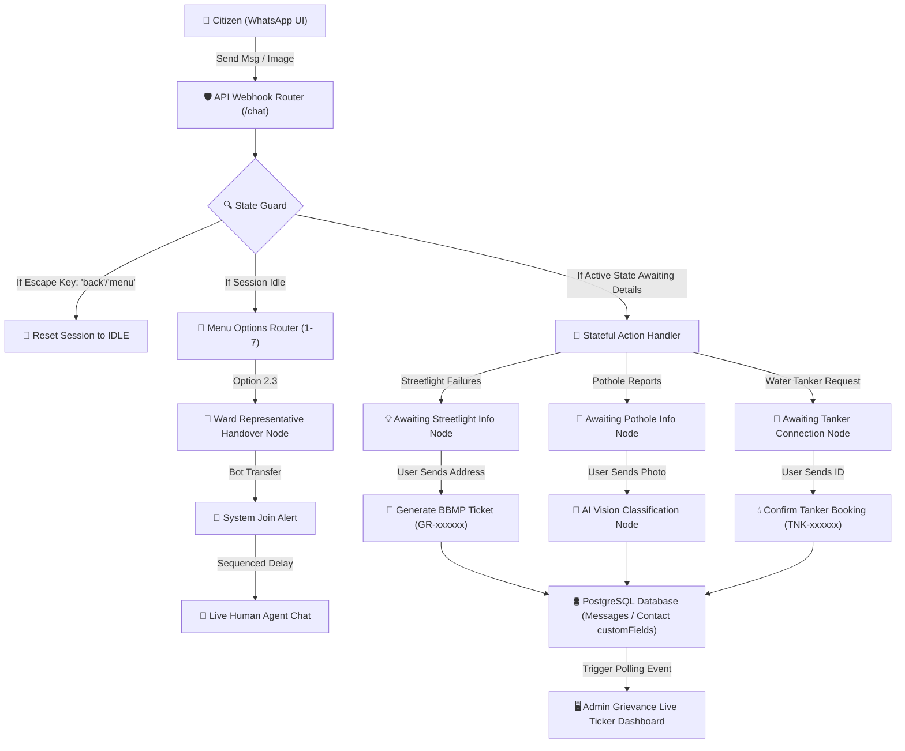

# Wavely Platform - Ram Taluri

A comprehensive SaaS platform for automating, broadcasting, and managing customer communications via WhatsApp Business API.

## 🚀 Features -- Updated August 2026

### 1. **Interactive Workflow Canvas & Drag-and-Drop Editor**
- **Draggable Node Editor (Demo 1)**: Visual absolute positioned nodes for trigger outbox, main options, and sub-options. Drag any card to reposition it; connecting curves stretch and re-route dynamically in real-time.
- **Node Position Persistence**: Automatically serializes and saves card coordinates to the server configuration database, retaining custom layouts across page loads and browser refreshes.
- **Generalized Campaign Canvas Builder**: A separate dedicated Canvas page (`/canvas`) implementing a generic workflow builder. Drag Triggers, Messages, Splits, and Delay blocks, edit contents, and draw custom flow connections.

### 2. **Stateful Chatbot & AI Vision Simulation**
- **Stateful Conversational Sessions**: Tracks contact conversation states dynamically (e.g. Awaiting Streetlight Address). Replaces flat regex checking with context-aware inputs.
- **Automated Data Type Extraction**: Parses 10-digit utility account IDs and 6-digit ticket tracking IDs (`GR-xxxxxx`) automatically to dispatch crews or report ticket progress status.
- **AI Computer Vision Photo Reports**: Citizen image attachments (potholes, streetlights, garbage dumps) are classified by the bot, triggering automated EXIF metadata location logging.

### 3. **Live Ward Grievance Dashboard Desk**
- **Real-Time Admin Ticker**: A live, auto-polling central desk widget that updates instantly as simulated citizens submit reports, highlighting new entries with visual neon green pulse highlights.
- **Sequenced Agent Handover Simulation**: Triggers system events and human agent handovers sequentially (typing delays, agent join alerts, outbound responses) in the simulator mockup.

### 4. **WhatsApp Broadcast**
- Send bulk template messages to contact segments
- Rate limiting and WhatsApp compliance
- Delivery and read status tracking
- Contact segmentation and targeting

### 3. **Campaign Management**
- Create and schedule campaigns
- Multi-step drip sequences
- Event-triggered campaigns
- Campaign analytics and performance metrics

### 4. **Marketing Automation**
- End-to-end automation workflows
- Event-based message triggers
- Contact segments and dynamic targeting
- Personalization with variables

### 5. **Multi-Agent Chat**. /// Ram To be further brainstormed for improvisation of Multi-Agent chat.  
- Shared inbox for one WhatsApp business number
- Agent assignment and routing
- Conversation transfer between agents
- Role-based access control

### 6. **OTP Sender**
- Secure OTP generation and validation
- Rate limiting and fraud protection
- Integration with verification flows

## 📐 Graph-Based Chatbot Architecture

The automated chatbot is engineered as a state-machine graph where transitions are guided by context nodes (saved in database contact sessions). The flow dynamically evaluates data types (regular option selections, 10-digit utility numbers, image metadata, and agent handover cues) to update the central admin desk ticker in real-time.



---

## 📊 Tech Stack

### Backend
- **Runtime:** Node.js 18+
- **Framework:** Express.js
- **Database:** PostgreSQL 15
- **Cache:** Redis 7
- **Job Queue:** BullMQ (Redis-based)
- **Authentication:** JWT + OAuth (Google, GitHub)
- **Payment:** Razorpay SDK

### Frontend
- **Library:** React 18
- **Router:** React Router v6
- **Styling:** Tailwind CSS
- **Build Tool:** Vite
- **HTTP Client:** Axios
- **State Management:** Zustand
- **Charts:** Recharts
- **Icons:** Lucide React

### DevOps
- **Containerization:** Docker
- **Orchestration:** Kubernetes
- **Hosting:** Hostinger Kubernetes
- **Container Registry:** Docker Hub / Private Registry

---

## 📁 Project Structure

```
WhatsAppAPI/
├── server/                      # Backend application
│   ├── src/
│   │   ├── index.js            # Main server entry point
│   │   ├── database/           # Database configuration & models
│   │   │   ├── index.js        # Sequelize setup
│   │   │   ├── models/         # Data models
│   │   │   │   ├── User.js
│   │   │   │   ├── Organization.js
│   │   │   │   ├── Contact.js
│   │   │   │   ├── Message.js
│   │   │   │   ├── Campaign.js
│   │   │   │   └── Broadcast.js
│   │   │   └── migrations/     # Database migrations
│   │   ├── services/           # Business logic
│   │   │   ├── WhatsAppService.js
│   │   │   └── RazorpayService.js
│   │   ├── routes/             # API routes
│   │   │   ├── auth.js
│   │   │   ├── whatsapp.js
│   │   │   ├── campaigns.js
│   │   │   ├── agents.js
│   │   │   ├── broadcast.js
│   │   │   ├── otp.js
│   │   │   └── contacts.js
│   │   ├── workers/            # Background job workers
│   │   ├── utils/              # Utilities
│   │   │   └── redis.js        # Redis & BullMQ setup
│   │   └── middleware/         # Express middleware
│   ├── package.json
│   ├── Dockerfile
│   └── .env.example

├── client/                      # Frontend application
│   ├── src/
│   │   ├── main.jsx            # React entry point
│   │   ├── App.jsx             # Root component
│   │   ├── index.css           # Global styles
│   │   ├── pages/              # Page components
│   │   │   ├── Dashboard.jsx
│   │   │   ├── Campaigns.jsx
│   │   │   ├── Broadcast.jsx
│   │   │   ├── Agents.jsx
│   │   │   ├── Contacts.jsx
│   │   │   ├── Settings.jsx
│   │   │   ├── Login.jsx
│   │   │   └── Register.jsx
│   │   ├── components/         # Reusable components
│   │   │   ├── Layout.jsx
│   │   │   └── ...
│   │   ├── services/           # API client services
│   │   └── store/              # Zustand state management
│   ├── index.html
│   ├── vite.config.js
│   ├── tailwind.config.js
│   ├── postcss.config.js
│   ├── Dockerfile
│   ├── nginx.conf
│   └── package.json

├── k8s/                        # Kubernetes manifests
│   ├── 00-namespace.yaml       # Namespace & ConfigMaps
│   ├── 01-postgres.yaml        # PostgreSQL StatefulSet
│   ├── 02-redis.yaml           # Redis Deployment
│   ├── 03-server.yaml          # Backend Deployment & HPA
│   ├── 04-client.yaml          # Frontend Deployment
│   └── 05-ingress.yaml         # Ingress Configuration

├── docker-compose.yml          # Local development setup
├── package.json               # Root package (workspaces)
└── README.md                  # This file
```

---

## 🚀 Getting Started

### Prerequisites
- Node.js 18+
- Docker & Docker Compose (for containerized setup)
- PostgreSQL 15 (local setup)
- Redis 7 (local setup)

### Local Development

#### 1. Clone & Setup
```bash
cd Wavely
npm install
```

#### 2. Environment Variables
```bash
# Copy example files
cp server/.env.example server/.env
cp client/.env.example client/.env

# Edit .env files with your credentials
# - Database credentials
# - WhatsApp API keys
# - Razorpay keys
# - OAuth credentials
```

#### 3. Using Docker Compose
```bash
docker-compose up --build
```

Access:
- **Frontend:** http://localhost:3000
- **Backend:** http://localhost:5000
- **API Docs:** http://localhost:5000/api

#### 4. Manual Setup (without Docker)

**Terminal 1 - Backend:**
```bash
cd server
npm install
npm run dev
```

**Terminal 2 - Frontend:**
```bash
cd client
npm install
npm run dev
```

---

## 📡 API Endpoints

### Authentication
- `POST /api/auth/register` - Register new user
- `POST /api/auth/login` - User login
- `POST /api/auth/verify` - Verify JWT token
- `POST /api/auth/refresh` - Refresh token

### Contacts
- `GET /api/contacts` - List all contacts
- `POST /api/contacts` - Create contact
- `GET /api/contacts/:id` - Get contact details
- `PUT /api/contacts/:id` - Update contact
- `DELETE /api/contacts/:id` - Delete contact
- `POST /api/contacts/import` - Bulk import contacts

### Campaigns
- `GET /api/campaigns` - List campaigns
- `POST /api/campaigns` - Create campaign
- `GET /api/campaigns/:id` - Get campaign details
- `PUT /api/campaigns/:id` - Update campaign
- `POST /api/campaigns/:id/start` - Start campaign
- `POST /api/campaigns/:id/pause` - Pause campaign

### Broadcast
- `GET /api/broadcast` - List broadcasts
- `POST /api/broadcast` - Create broadcast
- `GET /api/broadcast/:id` - Get broadcast details
- `POST /api/broadcast/:id/start` - Start broadcast

### Agents
- `GET /api/agents` - List agents
- `POST /api/agents` - Create agent
- `GET /api/agents/:id` - Get agent details
- `PUT /api/agents/:id` - Update agent
- `DELETE /api/agents/:id` - Delete agent

### OTP
- `POST /api/otp/send` - Send OTP
- `POST /api/otp/verify` - Verify OTP

### WhatsApp
- `POST /api/whatsapp/webhook` - Receive incoming messages
- `GET /api/whatsapp/webhook` - Verify webhook
- `POST /api/whatsapp/send` - Send message

---

## 🐳 Docker Deployment

### Build Images
```bash
docker build -t wavely-server:latest -f server/Dockerfile .
docker build -t wavely-client:latest -f client/Dockerfile .
```

### Push to Registry
```bash
docker tag wavely-server:latest your-registry/wavely-server:latest
docker push your-registry/wavely-server:latest

docker tag wavely-client:latest your-registry/wavely-client:latest
docker push your-registry/wavely-client:latest
```

---

## ☸️ Kubernetes Deployment (Hostinger)

### 1. Connect to Hostinger Kubernetes
```bash
# Get kubeconfig from Hostinger panel
kubectl config set-context your-cluster --kubeconfig=kubeconfig.yaml
```

### 2. Update Secret Values
Edit `k8s/00-namespace.yaml` with your actual credentials:
```bash
kubectl apply -f k8s/00-namespace.yaml
```

### 3. Deploy Services
```bash
# Deploy in order
kubectl apply -f k8s/01-postgres.yaml
kubectl apply -f k8s/02-redis.yaml
kubectl apply -f k8s/03-server.yaml
kubectl apply -f k8s/04-client.yaml
kubectl apply -f k8s/05-ingress.yaml
```

### 4. Monitor Deployments
```bash
# Check pod status
kubectl get pods -n wavely

# View logs
kubectl logs -f deployment/server -n wavely

# Check services
kubectl get svc -n wavely
```

### 5. Scale Deployments
```bash
kubectl scale deployment server --replicas=3 -n wavely
```

---

## 🔐 Security Best Practices

1. **Environment Variables:** Never commit `.env` files
2. **Secrets Management:** Use Kubernetes Secrets for sensitive data
3. **SSL/TLS:** Configure in Ingress for HTTPS
4. **Rate Limiting:** Implement on API routes
5. **CORS:** Configure properly in Express
6. **Input Validation:** Use `express-validator` on all routes
7. **Database:** Use parameterized queries (Sequelize handles this)

---

## 📦 Database Models

### User
- ID (UUID)
- Organization ID
- Name, Email, Password
- Role (admin/agent/viewer)
- OAuth credentials
- Timestamps

### Organization
- ID (UUID)
- Name, subscription details
- WhatsApp API credentials
- Razorpay credentials
- Message limits and usage

### Contact
- ID (UUID)
- Organization ID
- Phone number, name, email
- Custom fields (JSON)
- Tags, last message time
- Conversation status

### Message
- ID (UUID)
- Contact & Organization IDs
- Type (text/image/video/etc)
- Direction (inbound/outbound)
- Status (pending/sent/delivered/read/failed)
- Sender type (agent/bot/system)
- Campaign/Broadcast reference

### Campaign
- ID (UUID)
- Organization ID
- Name, template, type
- Status, schedule
- Target segments, variables
- Message stats

### Broadcast
- ID (UUID)
- Organization ID
- Name, template
- Status, contact list
- Message stats, timestamps

---

## 🛠️ Development Commands

### Root Level
```bash
npm run dev              # Start both server and client
npm run server:build     # Build server
npm run client:build     # Build client
npm run docker:build     # Build Docker images
npm run docker:up        # Start Docker Compose
npm run docker:down      # Stop Docker Compose
```

### Server
```bash
cd server
npm run dev              # Development with hot reload
npm run build            # Build for production
npm start                # Start production server
npm run migrations       # Run database migrations
npm run seed             # Seed database
```

### Client
```bash
cd client
npm run dev              # Development server
npm run build            # Build for production
npm run preview          # Preview production build
```

---

## 📞 WhatsApp API Integration

### Setup Steps:
1. Create Meta Business Account
2. Create WhatsApp Business App
3. Get Phone ID and Access Token
4. Configure webhook URL
5. Subscribe to messages webhook
6. Test with messages

### Webhook Payload Example:
```json
{
  "entry": [{
    "changes": [{
      "field": "messages",
      "value": {
        "messaging_product": "whatsapp",
        "messages": [{
          "from": "1234567890",
          "id": "message_id",
          "timestamp": "1234567890",
          "text": { "body": "Hello" },
          "type": "text"
        }]
      }
    }]
  }]
}
```

---

## 💳 Razorpay Integration

### Features Implemented:
- Order creation
- Payment verification
- Subscription plans
- Customer subscriptions

### Implementation:
See `server/src/services/RazorpayService.js` for all payment methods.

---

## 🤝 Contributing

1. Create feature branch: `git checkout -b feature/amazing-feature`
2. Commit changes: `git commit -m 'Add amazing feature'`
3. Push to branch: `git push origin feature/amazing-feature`
4. Open Pull Request

---

## 📄 License

This project is licensed under the MIT License.

---

## 📧 Support

For questions or issues, contact support@wavely.com

---

## 🎯 Roadmap

- [ ] AI-powered chatbot responses
- [ ] Advanced analytics dashboard
- [ ] WhatsApp Media management
- [ ] Custom workflow builder
- [ ] Twilio integration
- [ ] SMS backup delivery
- [ ] Mobile app
- [ ] Advanced segmentation

---

**Last Updated:** May 11, 2026
